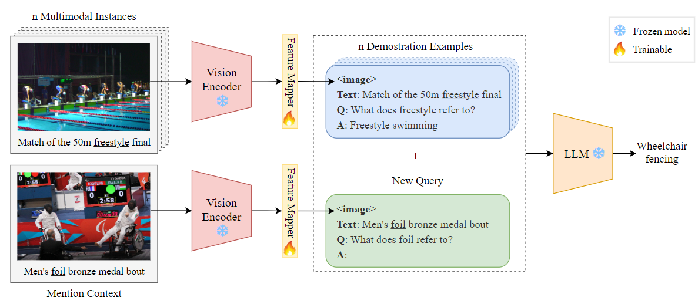

# GEMEL: Generative Multimodal Entity Linking

## :sparkles: Overview

This repository contains official implementation of our paper [Generative Multimodal Entity Linking](https://arxiv.org/abs/2306.12725).

GEMEL is a novel method that utilizes a generative Large Language Model (LLM) to address the Multimodal Entity Linking (MEL) task. We keep the vision and language model
frozen and only train a linear layer to enable cross-modality interactions. To adapt LLMs to the MEL task, we take advantage of the
emerging in-context learning (ICL) capability of LLMs by retrieving multimodal instances as demonstrations. Our method achieves state-of-the-art results on two well-established
MEL datasets, namely [WikiDiverse](https://arxiv.org/abs/2204.06347) and [WikiMEL](https://dl.acm.org/doi/abs/10.1145/3477495.3531867).

If you have any question, please feel free to contact me by e-mail: shisenbaohit@gmail.com or submit your issue in the repository.

## :fire: News

[23.07.14] We release the codes and the checkpoints of GEMEL.

## :rocket: Architecture

[Here](https://arxiv.org/abs/2306.12725), you can see the detailed architecture and some experimental analyses of GEMEL.

<p align="center" width="60%"></p>


## :rotating_light: Usage
    
### Environment

```
conda create env -n GEMEL python=3.7
conda activate GEMEL
pip install -r requirement.txt
```

### Data
We have preprocessed the text, image, and knowledge base data, and the results are in the `./data` folder.
```
train.json, dev.json, test.json         ->      textual data files
clip_vit_large_patch14_1024.hdf5        ->      visual data file
prefix_tree_opt.pkl                     ->      prefix tree of entity name
SimCSE_train_mention_embeddings.pkl     ->      training set mention embeddings
```

### Train
Running main.py directly will use the WikiDiverse dataset, opt-6.7b model:

`python main.py`

The model structure is in model.py, the default parameters are in params.py, and most of the data processing is in utils.py.

You can customize some parameter settings, see params.py. Some examples of training GEMEL are given here.

For training WikiDiverse:
```
python main.py --dataset wikidiverse --model_name opt-6.7b --ICL_examples_num 16
```

For training WikiMEL:
```
python main.py --dataset wikimel --model_name opt-6.7b --ICL_examples_num 16
```

### Test
The checkpoint for the linear mapper is saved in the `./checkpoint` folder.

For testing on WikiDiverse test set:
```
python infe.py --dataset wikidiverse --model_name opt-6.7b --best_ckpt opt-6.7b_wikidiverse_linear_4token_16examples_82_77.pkl
```

For testing on WikiMEL test set:
```
python infe.py --dataset wikimel --model_name opt-6.7b --best_ckpt opt-6.7b_wikimel_linear_4token_16examples_75_53.pkl
```


## Citation
```
@article{shi2023generative,
  title={Generative Multimodal Entity Linking},
  author={Shi, Senbao and Xu, Zhenran and Hu, Baotian and Zhang, Min},
  journal={arXiv preprint arXiv:2306.12725},
  year={2023}
}
```
## License
This repository respects to Apache license 2.0.


